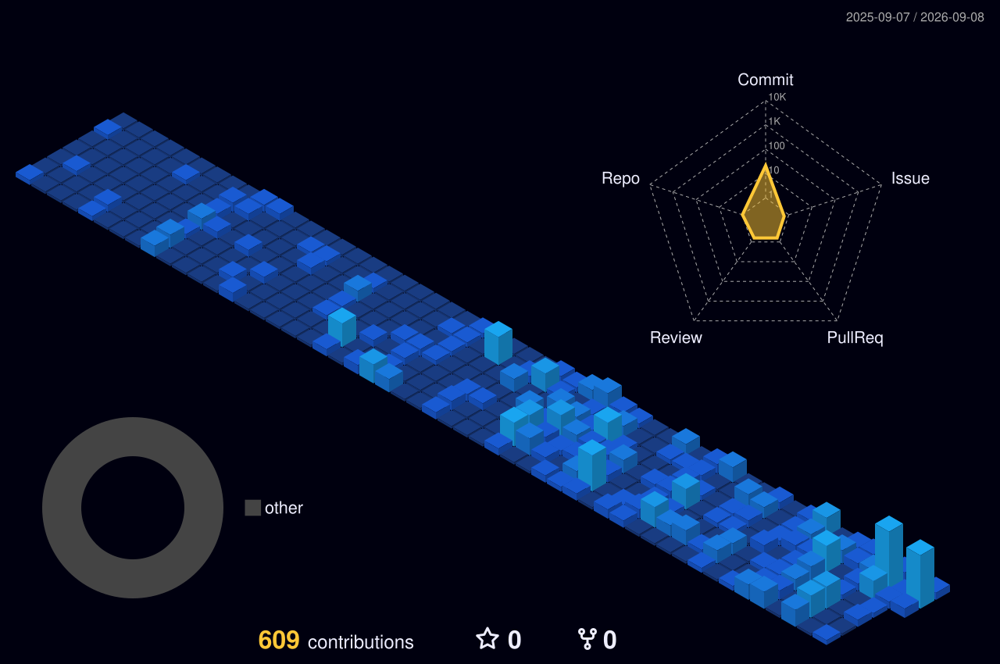

  <!-- Animated Contribution Snake -->
  <picture>
    <source media="(prefers-color-scheme: dark)" srcset="https://raw.githubusercontent.com/pratikgdh/pratikgdh/output/github-contribution-grid-snake-dark.svg">
    <source media="(prefers-color-scheme: light)" srcset="https://raw.githubusercontent.com/pratikgdh/pratikgdh/output/github-contribution-grid-snake.svg">
    
  </picture>

    

  <!-- 3D Isometric Contribution Grid / Blocks -->
  <picture>
    <source media="(prefers-color-scheme: dark)" srcset="profile-3d-contrib/profile-night-view.svg">
    
  </picture>

    

  <!-- Repository Orbit / Solar System Visualizer -->
  

    

  <!-- Dark Slate Contribution Activity Graph -->
  

    

  <!-- Dark Theme Streak Tracker Infographic -->
  

    

  <!-- Tech Stack Icons -->
  

